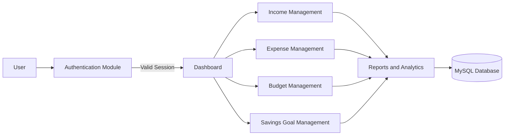
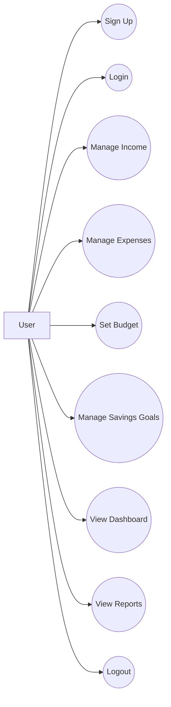
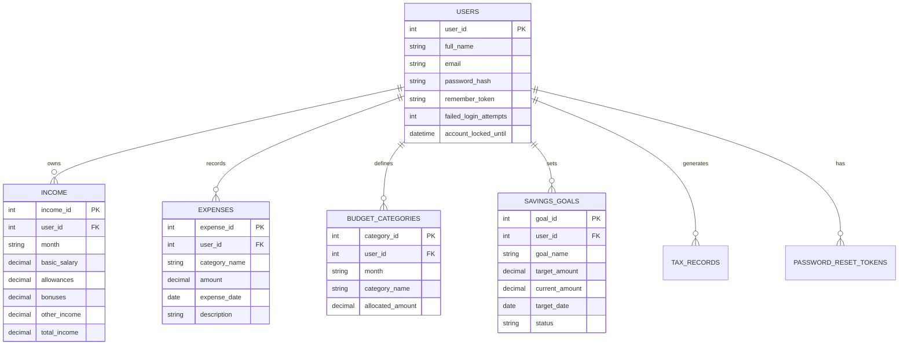
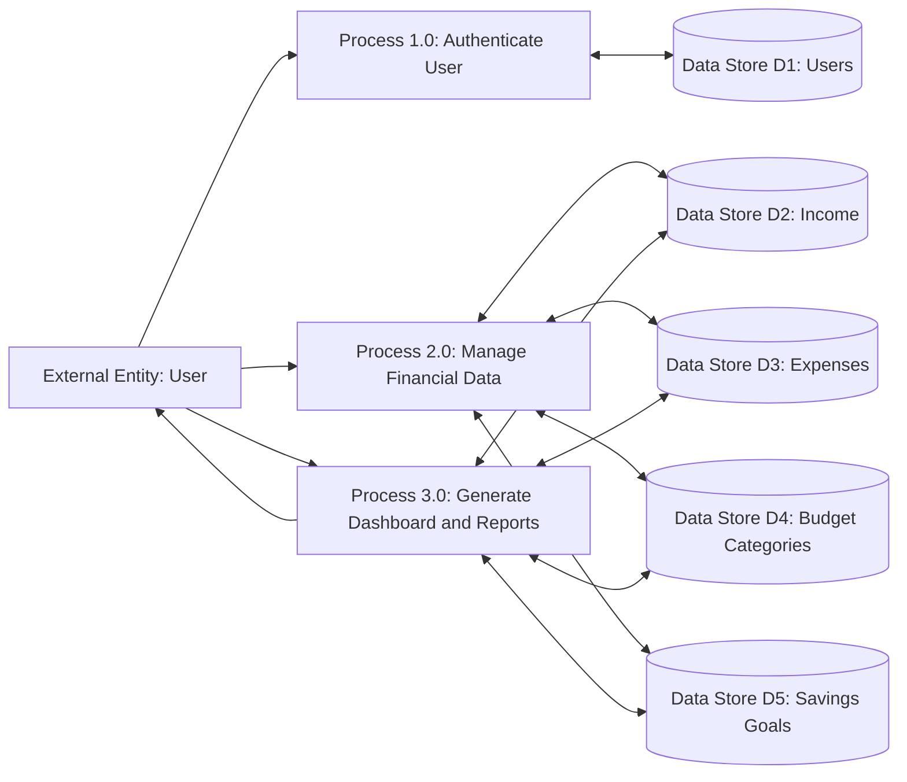
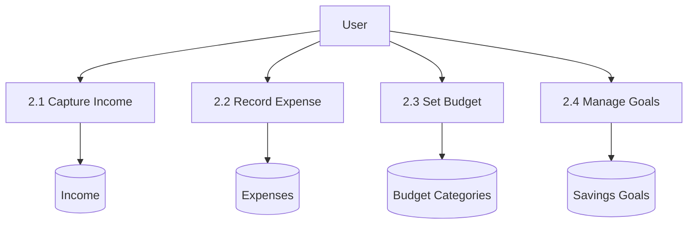
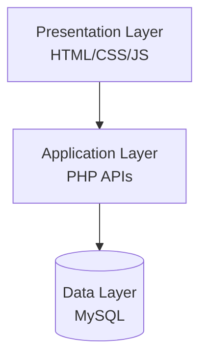
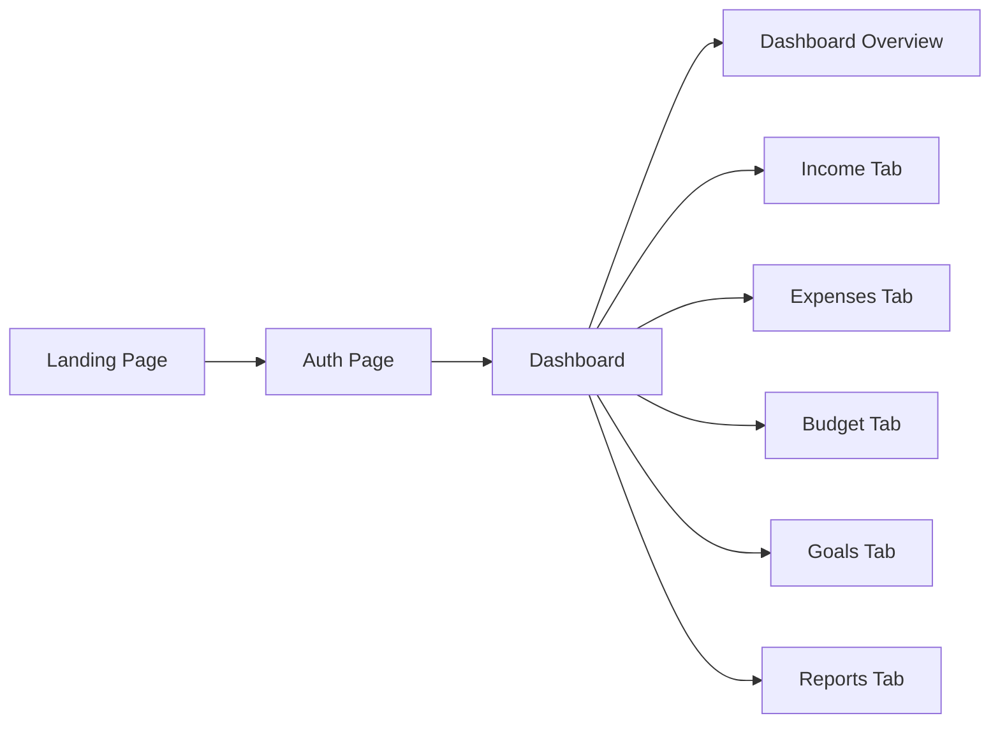
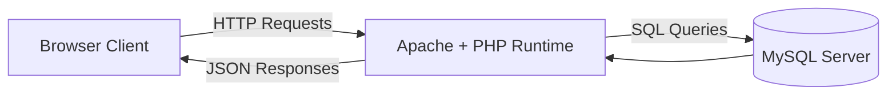
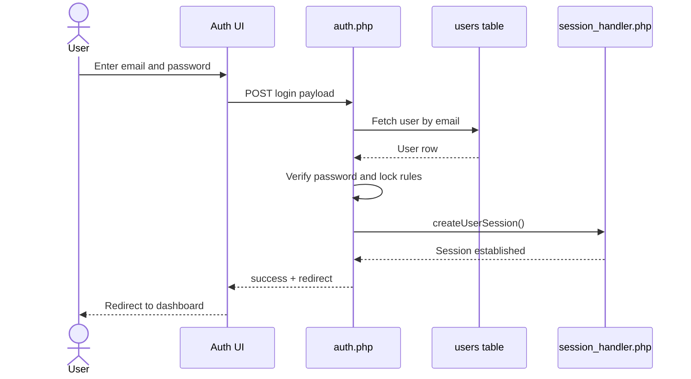

# Cover & Title Page

**Project Title:** Personal Budget & Finance Manager - Nepal Edition  
**Submitted By:** `<Student Name>`  
**Roll No.:** `<Roll Number>`  
**Program:** `<Program Name>`  
**Department:** `<Department Name>`  
**College:** `<College Name>`  
**University:** `<University Name>`  
**Supervisor:** `<Supervisor Name>`  
**Academic Year:** `<Academic Year>`  
**Submission Date:** `<Date>`

\newpage

# Certificate Page

## Supervisor Recommendation

This is to certify that the project report titled **"Personal Budget & Finance Manager - Nepal Edition"** was carried out by **`<Student Name>`** under my supervision in partial fulfillment of the requirements for the degree of **`<Program Name>`**. The work presented in this report is original, adequately documented, and suitable for submission.

**Supervisor Name:** `<Supervisor Name>`  
**Designation:** `<Designation>`  
**Department:** `<Department Name>`  
**Signature:** ____________________  
**Date:** `<Date>`

## Internal and External Examiners' Approval Letter

The project report titled **"Personal Budget & Finance Manager - Nepal Edition"** submitted by **`<Student Name>`** has been evaluated by the undersigned examiners and is approved for acceptance.

**Internal Examiner Name:** `<Internal Examiner>`  
**Signature:** ____________________  
**Date:** `<Date>`

**External Examiner Name:** `<External Examiner>`  
**Signature:** ____________________  
**Date:** `<Date>`

\newpage

# Abstract

This project presents the design and implementation of a web-based **Personal Budget & Finance Manager** tailored to practical household and individual financial planning in Nepal. The system enables authenticated users to record monthly income, track expenses by category, define category-wise budget limits, create savings goals, and view dashboard-level analytics with tax-aware calculations. The application is implemented using PHP, JavaScript, MySQL, HTML, and CSS, with a session-based authentication mechanism and role of server-side APIs for financial operations.

The implemented system addresses common issues in manual budgeting such as inconsistent record keeping, low visibility into category spending patterns, and lack of integrated tax perspective while planning savings. The report covers requirement analysis, feasibility, architecture, database design, process/data modeling, implementation details, and module-level testing. The proposed design adopts a modular structure where authentication, financial transactions, budgeting, goals, and reporting are logically separated but integrated through a unified user interface and backend API endpoints.

Results demonstrate that the system can centralize monthly financial activities and generate actionable spending insights. The project further identifies current technical limitations and outlines future improvements, including stronger access-control checks, enhanced analytics, and export-oriented reporting.

**Keywords:** Personal finance, Budget tracking, Expense analytics, Tax estimation, Savings goals, Web application

\newpage

# Acknowledgement

I would like to express my sincere gratitude to my supervisor, **`<Supervisor Name>`**, for continuous guidance, constructive feedback, and motivation throughout the planning, development, and documentation phases of this project. Their technical insight and encouragement helped shape both the implementation and report quality.

I am equally thankful to my family and classmates for their support, patience, and collaboration during the project period. Their suggestions, peer discussions, and moral encouragement played a vital role in completing this work effectively.

Finally, I would like to thank **`<Institution/College/Department/University Name>`** for providing the academic environment, resources, and opportunity to carry out this project as part of the curriculum requirements.

\newpage

# Table of Contents

1. Cover & Title Page  
2. Certificate Page  
3. Abstract  
4. Acknowledgement  
5. Table of Contents  
6. List of Abbreviations, List of Figures, List of Tables  
7. Project Proposal  
8. Main Report  
9. Appendices  
10. References  
11. Bibliography

\newpage

# List of Abbreviations

| Abbreviation | Full Form |
|---|---|
| API | Application Programming Interface |
| CRUD | Create, Read, Update, Delete |
| CSS | Cascading Style Sheets |
| DBMS | Database Management System |
| DFD | Data Flow Diagram |
| ERD | Entity Relationship Diagram |
| HTML | HyperText Markup Language |
| IEEE | Institute of Electrical and Electronics Engineers |
| JSON | JavaScript Object Notation |
| MVC | Model View Controller |
| PHP | Hypertext Preprocessor |
| SQL | Structured Query Language |
| SSF | Social Security Fund |
| UI | User Interface |
| UML | Unified Modeling Language |

\newpage

# List of Figures

1. [Figure 1: High-level working mechanism of proposed system](#figure-1-high-level-working-mechanism-of-proposed-system)  
2. [Figure 2: Use case diagram](#figure-2-use-case-diagram)  
3. [Figure 3: Gane and Sarson DFD Level 0](#figure-3-gane-and-sarson-dfd-level-0)  
4. [Figure 4: Gane and Sarson DFD Level 1 (financial operations)](#figure-4-gane-and-sarson-dfd-level-1-financial-operations)  
5. [Figure 5: ER diagram](#figure-5-er-diagram)  
6. [Figure 6: Three-layer architecture](#figure-6-three-layer-architecture)  
7. [Figure 7: Interface structure diagram](#figure-7-interface-structure-diagram)  
8. [Figure 8: Physical DFD](#figure-8-physical-dfd)  
9. [Figure 9: Login sequence diagram](#figure-9-login-sequence-diagram)

# List of Tables

1. [Table 1: Requirement collection summary](#table-1-requirement-collection-summary)  
2. [Table 2: Technical feasibility](#table-2-technical-feasibility)  
3. [Table 3: Operational feasibility](#table-3-operational-feasibility)  
4. [Table 4: Economic feasibility](#table-4-economic-feasibility)  
5. [Table 5: Gantt chart (project timeline)](#table-5-gantt-chart-project-timeline)  
6. [Table 6: Functional requirements list](#table-6-functional-requirements-list)  
7. [Table 7: Non-functional requirements list](#table-7-non-functional-requirements-list)  
8. [Table 8: Database schema summary](#table-8-database-schema-summary)  
9. [Table 9: Unit testing test cases](#table-9-unit-testing-test-cases)  
10. [Table 10: System testing test cases](#table-10-system-testing-test-cases)  
11. [Table 11: Formatting compliance checklist](#table-11-formatting-compliance-checklist)

\newpage

# Project Proposal

## 1. Introduction

The **Personal Budget & Finance Manager - Nepal Edition** is proposed to support users in handling monthly finances in one integrated platform. Instead of splitting information across notebooks, spreadsheets, and memory, users can capture their income, expenses, budgets, and savings goals from a single dashboard. The solution also integrates tax estimation to improve monthly planning quality and promote informed financial decisions.

## 2. Problem Statement

Individuals and families often face difficulty in maintaining accurate monthly financial records. Existing informal practices are error-prone, inconsistent, and weak in analytical feedback. The major problems observed are:

- Scattered records of income and expenses.
- No category-wise budget control and overspending alerts.
- Weak visibility into net monthly savings after tax implications.
- Limited local context for practical tax-aware financial planning.

## 3. Objectives

- To design a secure user authentication mechanism for personal financial data.
- To develop modules for monthly income capture and categorized expense tracking.
- To implement budget planning and budget-versus-actual comparison.
- To provide savings goal setup and progress tracking features.
- To generate dashboard and report views for better financial understanding.
- To incorporate Nepal-oriented tax and SSF calculations in financial summaries.
- To evaluate system reliability through unit and system testing.

## 4. Methodology

### a. Requirement Identification

#### i. Study of Existing System

The existing manual approach relies on ad hoc methods such as notes, mobile reminders, and spreadsheet fragments. These approaches do not ensure consistency or integrated visibility. In addition, most users do not connect spending behavior with tax and social security deductions during monthly planning.

#### ii. Requirement Collection

Requirements were identified by mapping real monthly budgeting tasks to software functions and validating each required task against the implemented modules in the current codebase.

### Table 1: Requirement collection summary

| User Need | System Requirement | Module |
|---|---|---|
| Quick monthly income entry | Income create/read/upsert flow (no delete in current release) with monthly uniqueness | `server.php` + `script.js` |
| Day-to-day expense records | Expense add/list/delete by month | `server.php` + `dashboard.php` |
| Spending control | Budget allocation and comparison | Budget module |
| Future planning | Savings goal management | Goals module |
| Insight generation | Dashboard metrics and charts | Reports module |
| Account security | Session auth, login lock support | `auth.php` + `session_handler.php` |

### b. Feasibility Study

### Table 2: Technical feasibility

| Criterion | Assessment |
|---|---|
| Technology stack availability | PHP, MySQL, JS, HTML, CSS are available in XAMPP environment |
| Implementation complexity | Moderate; manageable through modular API design |
| Performance expectation | Suitable for individual/small-scale user workload |
| Deployment readiness | Supports localhost and shared hosting migration |

### Table 3: Operational feasibility

| Criterion | Assessment |
|---|---|
| User adoption effort | Low; form-based interfaces and clear navigation tabs |
| Data entry process | Simple monthly and daily inputs |
| Maintenance effort | Moderate; code is modular and understandable |
| Practical usefulness | High for students, households, and salaried users |

### Table 4: Economic feasibility

| Criterion | Assessment |
|---|---|
| Software cost | Open-source stack, zero licensing cost |
| Infrastructure cost | Low; runs on common local machine/server |
| Development cost | Academic project effort, no enterprise overhead |
| Return on value | Better personal planning and reduced financial leakage |

### c. High Level Design of System (system flow chart / methodology / working mechanism)

### Figure 1: High-level working mechanism of proposed system

## 5. Gantt Chart (showing project timeline)

### Table 5: Gantt chart (project timeline)

| Activities | W1 | W2 | W3 | W4 | W5 | W6 | W7 | W8 | W9 | W10 | W11 | W12 |
|---|---|---|---|---|---|---|---|---|---|---|---|---|
| Requirement analysis | X | X |  |  |  |  |  |  |  |  |  |  |
| System design (UML/DFD/ERD) |  | X | X | X |  |  |  |  |  |  |  |  |
| Database design and setup |  |  | X | X |  |  |  |  |  |  |  |  |
| Authentication module implementation |  |  |  | X | X |  |  |  |  |  |  |  |
| Financial modules implementation |  |  |  |  | X | X | X |  |  |  |  |  |
| Dashboard and reports |  |  |  |  |  | X | X | X |  |  |  |  |
| Testing and debugging |  |  |  |  |  |  |  | X | X |  |  |  |
| Documentation and final report |  |  |  |  |  |  |  |  | X | X | X | X |

## 6. Expected Outcome

- A functional web application for finance tracking and planning.
- Centralized monthly financial records for authenticated users.
- Better spending visibility through category-level reports and dashboards.
- Improved awareness of tax and SSF impacts on net savings.
- Structured foundation for future expansion (export, alerts, forecasting).

## 7. References (Proposal)

[1] Oracle, "MySQL 8.0 Reference Manual," Oracle Corporation, 2024. [Online]. Available: https://dev.mysql.com/doc/  
[2] PHP Documentation Group, "PHP Manual: Sessions and Password Hashing," 2024. [Online]. Available: https://www.php.net/docs.php  
[3] Chart.js Contributors, "Chart.js Documentation," 2024. [Online]. Available: https://www.chartjs.org/docs/  
[4] IEEE, "IEEE Reference Guide," 2024. [Online]. Available: https://www.ieee.org/  
[5] OWASP Foundation, "Authentication and Session Management Guidance," 2024. [Online]. Available: https://owasp.org/

\newpage

# Main Report

\newpage

# Chapter 1: Introduction

## 1.1. Introduction

This project delivers a web-based personal finance system designed around practical monthly workflows: login, income entry, expense recording, budget allocation, savings goal tracking, and report visualization. The implementation is centered on modular backend APIs and a tab-based dashboard interface. The system was developed as an academic solution but targets real-world personal use, especially for users who need consistent budgeting with tax awareness.

## 1.2. Problem Statement

Users frequently struggle with fragmented financial information. Manual records become inconsistent over time, and users cannot quickly answer basic questions such as: "How much did I spend by category this month?", "Am I overspending against my budget?", and "What is my expected net savings after tax?" Existing ad hoc methods do not provide integrated operational visibility. This project addresses these gaps by unifying transaction entry, budget control, and dashboard reporting.

## 1.3. Objectives

- To provide secure access to personal financial records through session-based authentication.
- To capture monthly income components and calculate total income efficiently.
- To track daily expenses by category with date and description support.
- To compare budget allocation against actual spending for each category.
- To monitor savings goals through target and current progress values.
- To generate dashboard and report outputs for monthly financial analysis.
- To contextualize tax and SSF effects in monthly/annual financial summaries.

## 1.4. Scope and Limitation

### Scope

- Supports personal user account creation, login, logout, and session validation.
- Supports income management per user and month.
- Supports expense tracking with category, amount, date, and description.
- Supports budget setting by category and month.
- Supports savings goal creation, update, and deletion.
- Provides chart-based and table-based reporting from stored records.

### Limitation

- Authentication is required for API access, but object-level ownership checks are incomplete in `update_income`, `delete_expense`, `update_expense`, and `update_goal`.
- Tax and net-savings values are currently indicative because the progressive slab computation logic requires correction for precise taxation.
- CSRF helper functions exist in `session_handler.php`, but CSRF tokens are not enforced across state-changing endpoints, and query-string action routing allows GET-triggered state-change risk.
- No built-in export to PDF/Excel and no notification/reminder system.
- No integration with banking APIs; all entries are manual.
- No admin module and no advanced forecasting analytics.

## 1.5. Report Organization

### In point form

- Chapter 1 introduces the project problem, objectives, scope, and report structure.
- Chapter 2 presents the background study and literature review related to personal finance systems.
- Chapter 3 describes system analysis and design with requirement, feasibility, data/process, and architectural models.
- Chapter 4 explains implementation details and testing strategy with unit and system test cases.
- Chapter 5 concludes outcomes and lessons learned, and presents future recommendations.

### In sentence case

This report is organized into five chapters that move from project context to technical realization. The first chapter introduces the problem and objectives. The second chapter discusses the conceptual and comparative foundation. The third chapter formalizes analysis and design artifacts. The fourth chapter explains implementation and testing evidence. The fifth chapter summarizes outcomes and proposes improvements.

\newpage

# Chapter 2: Background Study and Literature Review

## 2.1. Background Study

The project is grounded in applied budgeting and transaction control rather than generic accounting theory. At implementation level, the system combines session-based web authentication, relational data modeling, and interactive dashboard interfaces.

The backend is built with PHP and MySQL. PHP handles request routing, validation, session state, and database operations through prepared statements. MySQL stores user records, monthly income, budget allocations, expense transactions, and savings goals. The frontend is driven by JavaScript for event handling, asynchronous fetch-based API calls, and dynamic rendering of tables/charts. Chart.js is used for visual analysis where categorical spending and monthly summaries are presented.

From a design perspective, the application follows a practical layered approach: presentation layer (HTML/CSS/JS), business/API layer (PHP functions by action), and persistence layer (MySQL tables). This makes module-level explanation and testing straightforward for academic reporting.

Key conceptually relevant elements include:

- Authentication lifecycle: signup, password hashing, login verification, session creation, and logout.
- Stateful access model: authenticated sessions are required, but object-level ownership checks are incomplete in `update_income`, `delete_expense`, `update_expense`, and `update_goal`.
- Monthly budgeting model: month-specific records for income and budget categories.
- Goal-oriented savings model: target amount, current amount, status.
- Decision support outputs: category summaries, budget utilization, and financial overview metrics.

The project also introduces local context by integrating tax and employee SSF impact in report calculations. While the progressive tax logic implementation has a known issue and needs refinement for strict slab accuracy, current tax and net-savings outputs should be interpreted as indicative estimates.

## 2.2. Literature Review

Personal finance applications are widely available, but they differ significantly in depth, complexity, and local adaptation. A focused literature review for this project should not merely list features of existing apps; instead, it should compare architectural and user-experience decisions against the practical requirements addressed by this implementation.

Many mainstream budget tools prioritize automation through bank connectivity, subscription models, and cross-device ecosystems. These systems reduce manual entry burden but often assume stable API integrations and payment infrastructure. In local academic or early-stage development contexts, manual entry remains a practical baseline because it removes integration complexity and enables validation of core financial workflows first. This project intentionally adopts that baseline and emphasizes correctness of core modules over integration breadth.

Another common pattern in existing systems is category-driven spending analytics. Most consumer finance apps classify spending into food, rent, utilities, transport, and discretionary categories, then provide periodic visual summaries. The implemented project follows the same conceptual pattern but keeps category management simple and explicit. This allows users to quickly map behavior to budget limits and understand variance without navigating complex taxonomies.

Research and product-oriented studies also highlight that users abandon budget apps when data entry friction is high or feedback value is low. This project addresses that by connecting each core input to a direct visual or numerical result. Income updates immediately affect tax and net calculations. Expense entries instantly influence dashboard totals and category-level reports. Budget entries feed comparison panels and utilization percentages. This closed-loop feedback design is consistent with retention-oriented findings in human-centered finance tooling.

Security practices in web applications remain critical even for academic prototypes. Literature and standards bodies repeatedly emphasize secure password storage, prepared statements, session control, and fixation prevention. The current system aligns with several baseline controls: password hashing, prepared statements, and session regeneration. The codebase also includes CSRF helper functions (`generateCSRFToken`, `validateCSRFToken`) in `session_handler.php`; however, CSRF tokens are not enforced across state-changing endpoints, and query-string action routing introduces GET-triggered state-change risk. Similarly, object-level ownership checks remain incomplete in selected update/delete paths. This gap is important to acknowledge academically because secure authentication alone does not guarantee secure authorization.

From a software engineering perspective, modular backend endpoint design is often recommended for maintainability and testing. The project reflects this through distinct actions (`add_income`, `get_expenses`, `set_budget`, `get_dashboard`, etc.) and matching frontend handlers. This approach simplifies mapping between requirements and code modules, which is valuable in Chapter 4 implementation documentation and testing traceability.

In data modeling literature, personal finance systems are commonly represented with entity sets around users, transactions, budgets, and goals. The current schema follows this established model and introduces month-based uniqueness constraints where appropriate (for example, one income record per user per month). Such constraints are useful for preventing duplicate aggregates and are consistent with data integrity guidance in transactional systems.

Visual analytics research supports the use of concise, interpretable charts for behavioral decision support. Doughnut and bar charts, when paired with tabular detail, balance readability and data density for non-technical users. The implemented use of chart views for expense composition and monthly reporting is aligned with this principle. At the same time, the design can be improved through trend lines, anomaly detection, and multi-month comparisons in future iterations.

Local-context systems, especially those used for education and household planning, benefit from tax-aware budgeting. Generic budget apps frequently omit country-specific deductions or require premium add-ons. This project includes Nepal-oriented tax and SSF concepts so users can estimate net financial position rather than gross values only. Even though the tax formula implementation must be corrected, the inclusion of this context is a strong differentiator in relevance.

Comparative review across methodologies indicates that process-modeling notation choices (Yourdon and DeMarco, Gane and Sarson, SSADM) should be selected based on readability for the target audience. For this report, Gane and Sarson is selected because its process and data-store emphasis is suitable for describing transactional web systems with clear input-output boundaries.

In summary, existing studies and tools validate the importance of low-friction data entry, secure-by-default architecture, meaningful monthly analytics, and contextual financial outputs. The current project aligns with these principles while remaining lightweight enough for educational delivery. Its principal contribution is not novelty in algorithmic finance but practical integration of essential budgeting modules into one coherent and extensible system.

\newpage

# Chapter 3: System Analysis and Design

## 3.1. System Analysis

### 3.1.1. Requirement Analysis

#### i. Functional Requirements (illustrated using use case list and diagram)

### Table 6: Functional requirements list

| FR ID | Functional Requirement | Description |
|---|---|---|
| FR-01 | User signup | User can create account with validated name, email, and password |
| FR-02 | User login/logout | User can login with credentials and logout securely |
| FR-03 | Session verification | System checks authentication state before protected access |
| FR-04 | Add/update income | User can save monthly income details |
| FR-05 | Add/list/delete expenses | User can record and review expenses by month |
| FR-06 | Set/get budget | User can assign category budgets for selected month |
| FR-07 | Manage savings goals | User can add, update, and delete savings goals |
| FR-08 | Calculate tax metrics | System can compute tax/SSF-based financial summaries |
| FR-09 | Dashboard overview | User can view aggregated monthly KPIs |
| FR-10 | Report generation view | User can view category and monthly analytics |

### Figure 2: Use case diagram

#### ii. Non Functional Requirements

### Table 7: Non-functional requirements list

| NFR ID | Requirement | Target |
|---|---|---|
| NFR-01 | Usability | Simple tab-driven navigation and readable forms |
| NFR-02 | Security | Password hashing, session controls, auth guards |
| NFR-03 | Performance | Typical API responses within practical local usage limits |
| NFR-04 | Reliability | Data persistence with relational integrity constraints |
| NFR-05 | Maintainability | Modular backend functions and clear UI module boundaries |
| NFR-06 | Compatibility | Browser-based access on modern desktop/mobile browsers |

### 3.1.2. Feasibility Analysis

#### i. Technical

The selected stack (PHP + MySQL + JS + Chart.js) is available in existing development infrastructure and already implemented in the codebase. Required capabilities (session auth, CRUD APIs, chart rendering) are supported without additional proprietary tools.

#### ii. Operational

The system matches day-to-day financial behavior and requires minimal onboarding. The UI structure mirrors user mental model: income, expenses, budget, goals, and reports.

#### iii. Economic

Development and deployment cost is low due to open-source technologies and local hosting support. The project is economically feasible for academic and small-scale practical use.

#### iv. Schedule

The phased timeline in the Gantt chart demonstrates completion feasibility within a semester-scale schedule.

### 3.1.3. Data Modeling (ER-Diagram)

### Figure 5: ER diagram

### Table 8: Database schema summary

| Table | Purpose | Key Constraints |
|---|---|---|
| `users` | Identity and login control | Unique email, lock/attempt tracking |
| `income` | Monthly income records | Unique (`user_id`, `month`) |
| `expenses` | Daily expense entries | Indexed by user/date |
| `budget_categories` | Monthly category budgets | Unique (`user_id`, `month`, `category_name`) |
| `savings_goals` | Savings targets and progress | Goal status tracking |
| `tax_records` | Reserved for future tax snapshot persistence (currently unused) | User/month linkage |

### 3.1.4. Process Modeling (DFD)

Data Flow Diagrams are commonly categorized by multiple methodologies, including **Yourdon and DeMarco**, **Gane and Sarson**, and **SSADM**. This report adopts **Gane and Sarson notation** for clarity in process-data store interaction.

### Figure 3: Gane and Sarson DFD Level 0

### Figure 4: Gane and Sarson DFD Level 1 (financial operations)

## 3.2. System Design

### 3.2.1. Architectural Design

The system uses a three-layer web architecture:

- Presentation layer: HTML, CSS, JavaScript (`dashboard.php`, `auth.html`, `script.js`, `auth.js`).
- Application/API layer: PHP action-based endpoints (`auth.php`, `server.php`).
- Data layer: MySQL schema (`database.sql`).

### Figure 6: Three-layer architecture

### 3.2.2. Database Schema Design

Schema is normalized around user-centric entities. Core design choices include:

- User-to-module one-to-many mappings.
- Monthly uniqueness constraints for stable aggregation.
- Indexed date/user fields for expense retrieval.
- Goal status lifecycle (`active`, `completed`, `cancelled`).

### 3.2.3. Interface Design (UI Interface / Interface Structure Diagrams)

### Figure 7: Interface structure diagram

UI decisions include tab-based navigation, month selector, card metrics, table views, and chart views to minimize context switching.

### 3.2.4. Physical DFD

### Figure 8: Physical DFD

\newpage

# Chapter 4: Implementation and Testing

## 4.1. Implementation

### 4.1.1. Tools Used

- Programming language: PHP, JavaScript
- Markup and styling: HTML, CSS
- Database platform: MySQL
- Local server stack: XAMPP
- Charting library: Chart.js
- Browser debugging: Developer tools (network and console)

### 4.1.2. Implementation Details of Modules

#### Authentication module

- File references: `auth.php`, `auth.js`, `session_handler.php`, `auth.html`.
- Features: signup validation, login verification, failed-attempt lock, remember token, session checks.
- Password handling: `password_hash()` and `password_verify()` based flow.

#### Income module

- API actions: `add_income`, `get_income`, `update_income` (no delete action in current release; `add_income` currently performs month-level upsert behavior).
- Persistence: `income` table with month-level uniqueness.
- UI integration: income form with total calculation and tax display triggers.

#### Expense module

- API actions: `add_expense`, `get_expenses`, `delete_expense`, `update_expense`.
- Authorization caveat: object-level ownership checks are currently incomplete in `delete_expense` and `update_expense`.
- Data usage: month-filtered retrieval and table rendering.
- UI action: add/delete expense with dashboard refresh.

#### Budget module

- API actions: `set_budget`, `get_budget`.
- Persistence strategy: replace monthly category allocations per user.
- UI integration: budget inputs and progress bar comparison with actual spending.

#### Savings goals module

- API actions: `add_goal`, `get_goals`, `update_goal`, `delete_goal`.
- Authorization caveat: `update_goal` currently lacks an ownership predicate, while `delete_goal` includes a user ownership condition.
- Data model: target amount, current amount, status, target date.
- UI integration: goal cards with progress visualization.

#### Reports and dashboard module

- API actions: `get_dashboard`, `get_monthly_report`, `get_category_summary`, `calculate_tax`.
- Outputs: KPI cards, category chart, monthly report chart, category report table.
- Caveat: tax and net-savings outputs are indicative until progressive slab logic is corrected.

### Figure 9: Login sequence diagram

## 4.2. Testing

Testing evidence in this release is based on manual execution and observation (UI actions + API responses in browser developer tools). No automated unit/system test framework is currently configured.

### 4.2.1. Manual Validation Scenarios (Unit-level)

### Table 9: Unit testing test cases

| Test ID | Module | Input / Action | Expected Result | Status |
|---|---|---|---|---|
| UT-01 | Signup validation | Invalid email format | Validation error message returned | Observed (manual) |
| UT-02 | Signup validation | Weak password | Password rule rejection | Observed (manual) |
| UT-03 | Login security | Wrong password repeated | Account lock after threshold | Observed (manual) |
| UT-04 | Income save | Valid monthly income payload | Record inserted/updated successfully | Observed (manual) |
| UT-05 | Expense add | Valid category/amount/date | Expense row inserted | Observed (manual) |
| UT-06 | Expense delete | Existing expense id | Record deleted and UI refreshed | Observed (manual) |
| UT-07 | Budget set | Category allocation array | Monthly budget records replaced | Observed (manual) |
| UT-08 | Goal create | Valid goal data | Goal visible in goal list | Observed (manual) |
| UT-09 | Dashboard load | Valid month and session | KPI cards and chart data returned (tax/net-savings interpreted as indicative) | Observed (manual) |
| UT-10 | Session guard | Unauthenticated API call | Redirect/auth-required response | Observed (manual) |

### 4.2.2. Manual Validation Scenarios (System-level)

### Table 10: System testing test cases

| Test ID | Scenario | Steps | Expected Outcome | Status |
|---|---|---|---|---|
| ST-01 | New user onboarding | Signup -> auto-login -> dashboard | User account created, session active, dashboard accessible | Observed (manual) |
| ST-02 | Monthly budgeting flow | Add income -> set budget -> add expenses | Budget comparison updates against recorded expenses | Observed (manual) |
| ST-03 | Savings tracking flow | Add goal -> update amount -> view progress | Goal progress bar and values update correctly | Observed (manual) |
| ST-04 | Reporting flow | Enter expenses in multiple categories -> open reports | Charts and category table reflect category totals; tax/net-savings treated as indicative | Observed (manual) |
| ST-05 | Session expiry handling | Stay idle beyond timeout -> call API | User is redirected/re-authenticated | Observed (manual) |
| ST-06 | Security lock flow | Repeated failed logins | Temporary lock message shown with wait time | Observed (manual) |

\newpage

# Chapter 5: Conclusion and Future Recommendations

## 5.1. Lesson Learnt / Outcome

The project demonstrates how a modular full-stack architecture can translate everyday financial tasks into a coherent digital workflow. It also shows that data modeling decisions (month-wise uniqueness, user-linked transactions) strongly influence reporting reliability. Practical lessons include the importance of end-to-end flow validation, secure session handling, and requirement-to-module traceability in academic software projects.

## 5.2. Conclusion

The **Personal Budget & Finance Manager - Nepal Edition** successfully implements core personal finance capabilities in an integrated web application. Users can perform essential financial operations from one dashboard and obtain actionable monthly insights. The project meets major functional goals and provides a usable foundation for real-world adaptation, while documenting technical boundaries transparently.

## 5.3. Future Recommendations

- Add strict ownership checks for all update/delete operations to improve authorization safety.
- Correct and extend progressive tax computation for complete slab accuracy.
- Introduce CSV/PDF export and printable monthly statements.
- Add reminders, notifications, and recurring transaction support.
- Add trend forecasting and anomaly detection for advanced analytics.
- Add responsive enhancements and accessibility conformance improvements.

\newpage

# Appendices

## Appendix A: Screen Shots

Include screenshots in final submission package:

- Landing page
- Login and signup forms
- Dashboard overview
- Income section
- Expenses section
- Budget section
- Savings goals section
- Reports section

## Appendix B: Source Codes

Reference key source files:

- `index.php`
- `auth.html`, `auth.js`, `auth.php`
- `dashboard.php`, `script.js`
- `server.php`
- `session_handler.php`
- `config.php`
- `database.sql`

## Appendix C: Supervisor Visit Log Sheets

| Visit No. | Date | Discussion Summary | Supervisor Remarks | Signature |
|---|---|---|---|---|
| 1 | `<Date>` | Requirement finalization | `<Remark>` | `<Sign>` |
| 2 | `<Date>` | Design and schema review | `<Remark>` | `<Sign>` |
| 3 | `<Date>` | Implementation progress review | `<Remark>` | `<Sign>` |
| 4 | `<Date>` | Testing and report review | `<Remark>` | `<Sign>` |

\newpage

## Appendix D: Formatting Compliance Notes for Final Word Submission

The Markdown content is prepared to match your required structure. While converting to Word/PDF, apply the following settings exactly.

### Table 11: Formatting compliance checklist

| Rule | Required Standard | Compliance Action |
|---|---|---|
| Page size | A4 | Set A4 in page setup |
| Margins | Top 1, Bottom 1, Right 1, Left 1.25 inch | Apply custom margins |
| Font | Times New Roman | Set all body text to TNR |
| Body font size | 12 | Apply to paragraph text |
| Paragraph alignment | Justified | Apply globally |
| Line spacing | 1.5 | Apply globally |
| Chapter title size | 16 bold | Apply heading style |
| Section heading size | 14 bold | Apply heading style |
| Sub-section heading size | 12 bold | Apply heading style |
| Caption style | 12 bold, centered | Figures below, tables above |
| Numbering (front matter) | Roman (i, ii, iii, ...) | Set from certificate to lists |
| Numbering (chapters onward) | Numeric (1, 2, 3, ...) | Restart from Chapter 1 |
| Chapter start | New page | Insert page break before each chapter |
| Abstract keywords | Max 5-6 | Already kept at 6 keywords |
| Acknowledgement | 3 paragraphs in required order | Included |
| Abbreviations | A-Z sorted in single-page table | Included |
| Objectives | Start with "To" | Included |
| DFD methodology | Gane and Sarson | Included |

\newpage

# References

[1] IEEE, "IEEE Reference Guide," 2024. [Online]. Available: https://www.ieee.org/  
[2] PHP Documentation Group, "PHP Manual: Sessions," 2024. [Online]. Available: https://www.php.net/manual/en/book.session.php  
[3] PHP Documentation Group, "PHP Manual: Password Hashing," 2024. [Online]. Available: https://www.php.net/manual/en/book.password.php  
[4] Oracle, "MySQL 8.0 Reference Manual," Oracle Corporation, 2024. [Online]. Available: https://dev.mysql.com/doc/  
[5] Chart.js Contributors, "Chart.js Documentation," 2024. [Online]. Available: https://www.chartjs.org/docs/latest/  
[6] OWASP Foundation, "Authentication Cheat Sheet," 2024. [Online]. Available: https://cheatsheetseries.owasp.org/  
[7] I. Sommerville, *Software Engineering*, 10th ed. Boston, MA, USA: Pearson, 2016.  
[8] R. S. Pressman and B. R. Maxim, *Software Engineering: A Practitioner's Approach*, 8th ed. New York, NY, USA: McGraw-Hill, 2015.  
[9] Government of Nepal, Inland Revenue Department, "Income Tax Information and Guidance," 2024. [Online]. Available: https://ird.gov.np/  
[10] M. Fowler, *UML Distilled: A Brief Guide to the Standard Object Modeling Language*, 3rd ed. Boston, MA, USA: Addison-Wesley, 2003.  
[11] C. J. Date, *An Introduction to Database Systems*, 8th ed. Boston, MA, USA: Pearson, 2003.  
[12] ISO/IEC 25010, "Systems and software engineering - Systems and software Quality Requirements and Evaluation (SQuaRE)," 2011.

\newpage

# Bibliography (if any)

- R. Elmasri and S. B. Navathe, *Fundamentals of Database Systems*, 7th ed. Pearson, 2016.  
- A. Dennis, B. H. Wixom, and D. Tegarden, *Systems Analysis and Design: An Object-Oriented Approach with UML*, 5th ed. Wiley, 2015.  
- D. Crockford, *JavaScript: The Good Parts*. O'Reilly Media, 2008.
